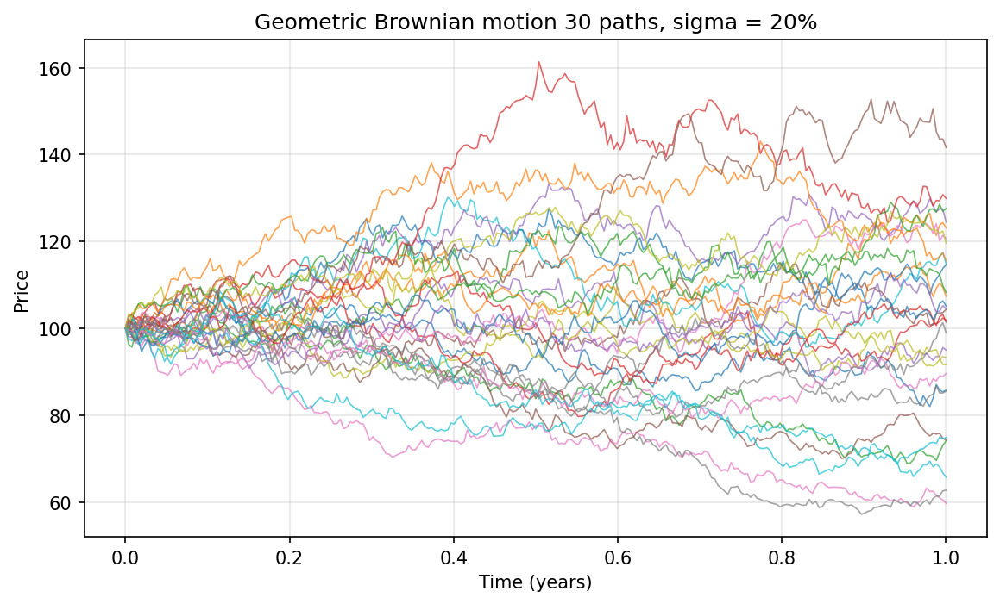
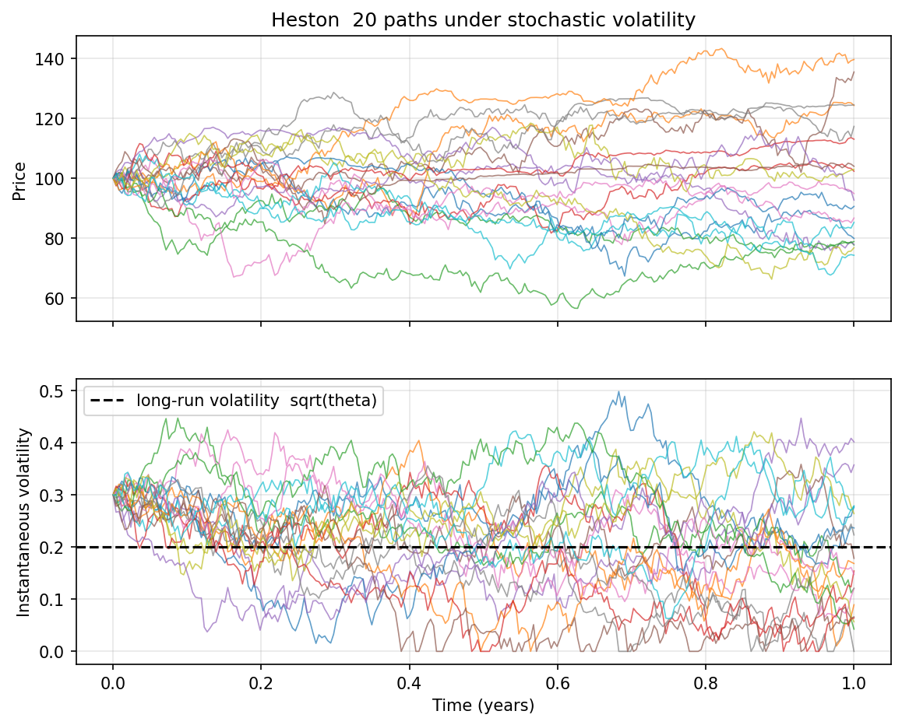
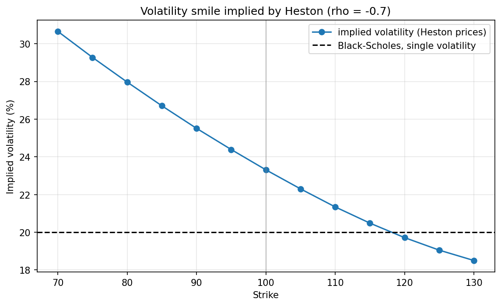
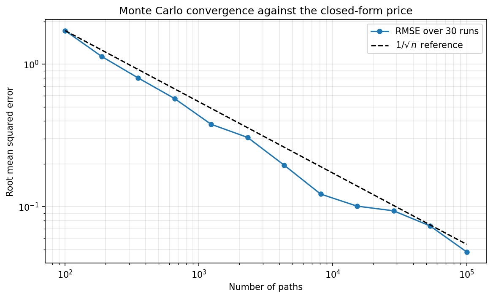

# Option Pricing

European option pricing in Python, built while studying derivatives at
Paris Dauphine-PSL: Black-Scholes, Monte Carlo, Heston stochastic
volatility, and implied volatility inversion.

Each model is checked against something I can verify: put-call parity,
the closed-form price, or a round-trip through the inversion. Running
`example.py` prints those checks and regenerates the figures below.

## Models

| File | Content |
|---|---|
| `black_scholes.py` | Closed-form European call and put |
| `simulation.py` | Geometric Brownian motion paths |
| `monte_carlo.py` | Monte Carlo pricer with antithetic variates |
| `heston.py` | Stochastic volatility simulation and pricing |
| `implied_volatility.py` | Bisection inversion of the Black-Scholes price |

## Usage

```bash
pip install -r requirements.txt
python example.py
```

## Simulation

Under geometric Brownian motion, volatility is a single number that never
changes. The paths differ only through the noise.



Heston replaces that constant with a variance that moves and is pulled
back towards a long-run level:

```
dS_t = r S_t dt + sqrt(v_t) S_t dW1_t
dv_t = kappa (theta - v_t) dt + xi sqrt(v_t) dW2_t
corr(dW1, dW2) = rho
```

The lower panel is what the model adds: volatility drifts and clusters
instead of staying flat.



Several variance paths hit zero here. That is expected: with these
parameters `2 * kappa * theta` is smaller than `xi^2`, so the variance is
not guaranteed to stay positive, and the scheme floors it at zero.

## The skew

Black-Scholes prices every strike with one volatility. Inverting prices
strike by strike shows that this does not hold.

The curve below was produced entirely inside this repository: options
priced under Heston, then read back through the Black-Scholes inversion.
The dashed line is the single volatility Black-Scholes would use. The
negative correlation between price and variance is what makes the curve
slope down.



## Convergence

The Monte Carlo estimator draws the terminal price directly from the
exact solution, so there is no discretisation error, only statistical
error, which decays as one over the square root of the number of paths.



Antithetic variates pair each draw Z with -Z. On this at-the-money call
the standard error drops by about 25%. The gain is small because the
payoff is close to linear over the region that matters.

## Limitations

- Heston uses a simple Euler scheme with the variance floored at zero.
  It is accurate enough for these figures but biased when the time step
  is large.
- No calibration to market data: the Heston parameters are chosen by
  hand, not fitted to real quotes.
- European options only, no early exercise.
- All paths are stored in memory, so the number of paths is limited by
  RAM.
- The inversion uses bisection: safe, but slower than a Newton method.

---

Silas Houngnibo - M1 Economics & Finance, Université Paris Dauphine-PSL
